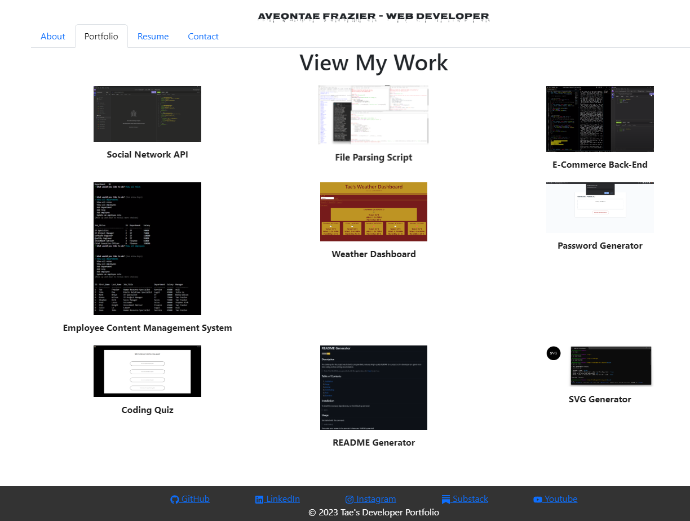

# My Portfolio Webpage

## Description
This is the portfolio page I created utilizing React.js, and Vite.js. 

## Usage
Click [Here](https://taesportfolio.netlify.app/#portfolio) to go to the deployed webpage. 

## License
This project is licensed under the MIT license.

  
## Questions
If you have any questions about the repo, open an issue or contact me directly at [amfrazier01@gmail.com](mailto:amfrazier01@gmail.com). You can find more of my work at [afrazier01](https://github.com/afrazier01)